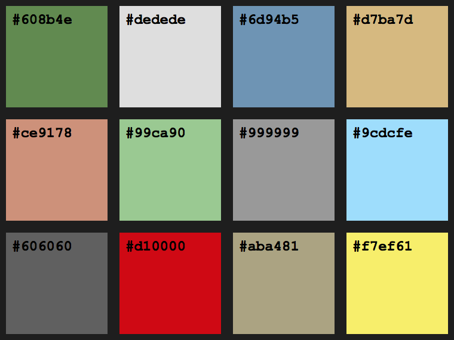

# SS-Octpus Theme

A Dark theme for [Visual Studio Code](http://code.visualstudio.com/).

## Color Palette

## Supports

* Typescript
* ES2015+
* Node
* HTML
* SCSS
* CSS
* JSON
* Dockerfile
* Ruby
* Go
* Nginx
* yml

_SS-Octopus was written by me, for me.  As such, I don't expect this theme to work for everybody or, perhaps, anybody._

## Examples

### Javascript

#### Angular

#### Typescript

#### ES2015+

#### Node

### SCSS
### Ruby
### Go
### JSON
### YML

## Installation

1) Go to Extensions
1) Search for ss-octopus
1) Install
1) Restart Visual Studio Code (or click Reload window)
1) Go to Preferences → Color Theme and choose SS-Octopus

**Enjoy!**

# The Squishy Parts

## Motivation

I wanted to make a theme that satisfied some of the pain points I've run into with existing themes.  The goals for SS-Octopus are:

* Support the languages I frequently work with
* Highlight mostly the important parts of the code
* Allow for easy updating by organizing theme by color, not by scope

## Why ss-octopus

Two (bad) reasons:
1) For some reason I like to name some of my projects as if they were ships, prefixed with `ss` and named after some creature of the sea
1) I previously wrote an unpublished theme for the [Atom](https://atom.io/) editor that had the same name

Essentially, *SS-Octopus* is a nonsensical name that makes me giggle softly to myself when I see it because I know it doesn't mean anything and I know people will ask, 'Why the name?'.

## Inspirations

* This whole adventure started after I read the `Motivation` section of the [Alabaster Theme](https://github.com/tonsky/vscode-theme-alabaster) readme.
* Example files from [Night Owl](https://github.com/sdras/night-owl-vscode-theme)
  * `angular.component.ts`
  * `react.js`
  * `ruby.rb`
  * `yml.yml`

## License

[MIT License](LICENSE)
